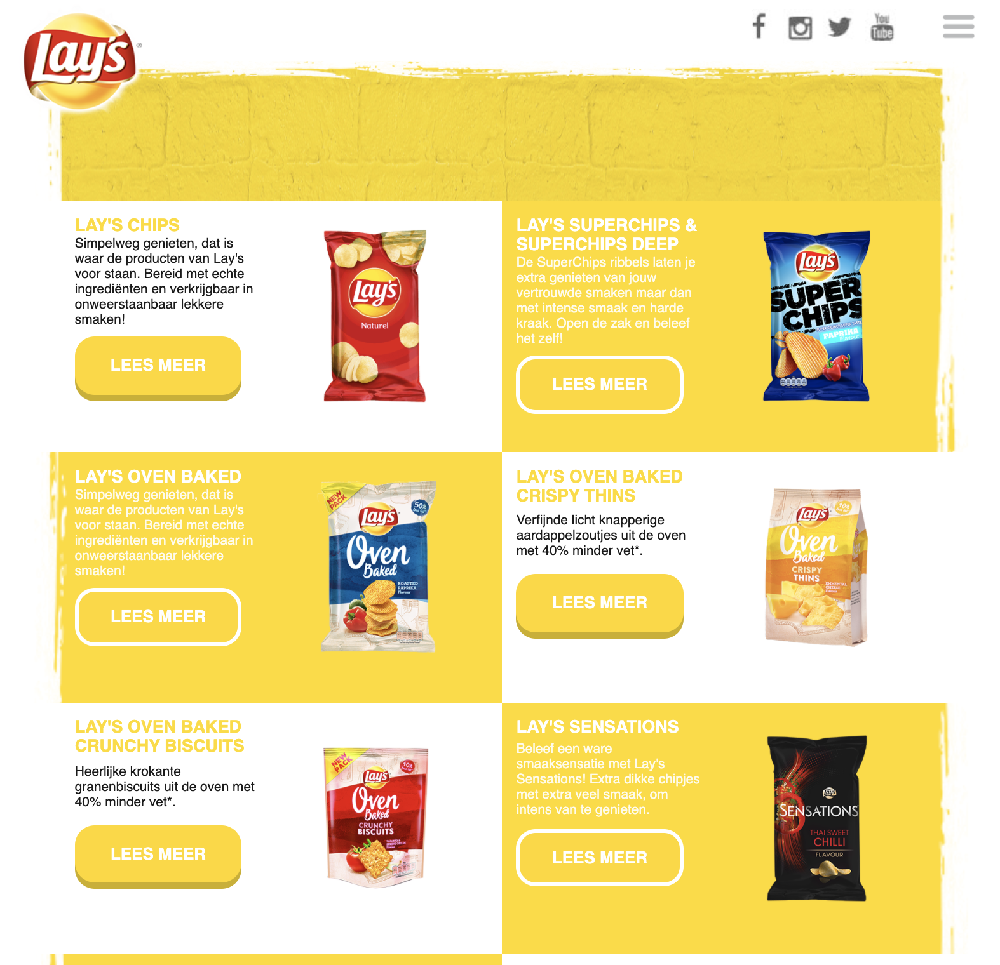
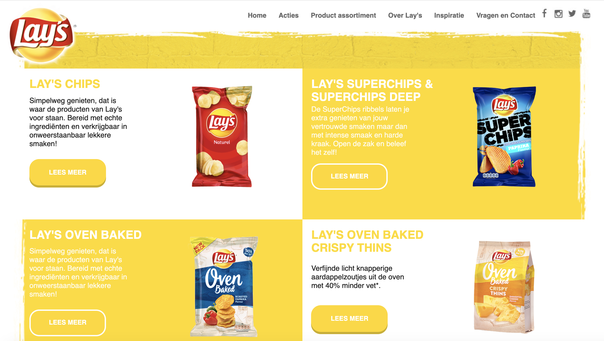
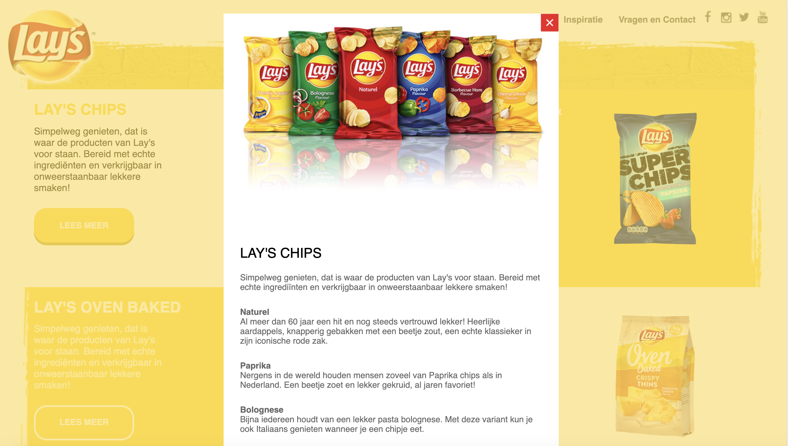
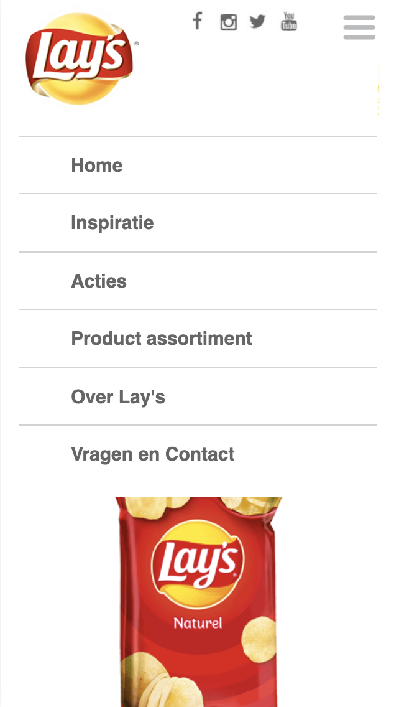
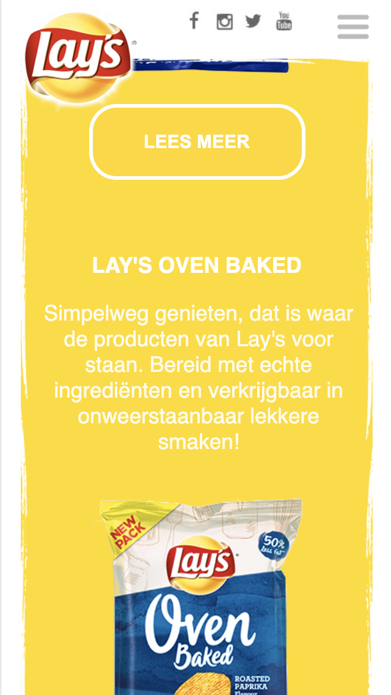
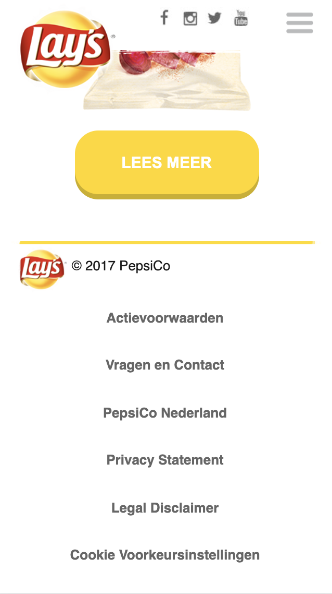
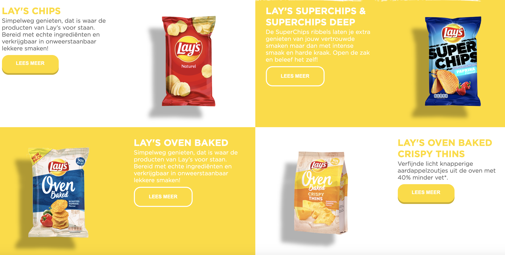
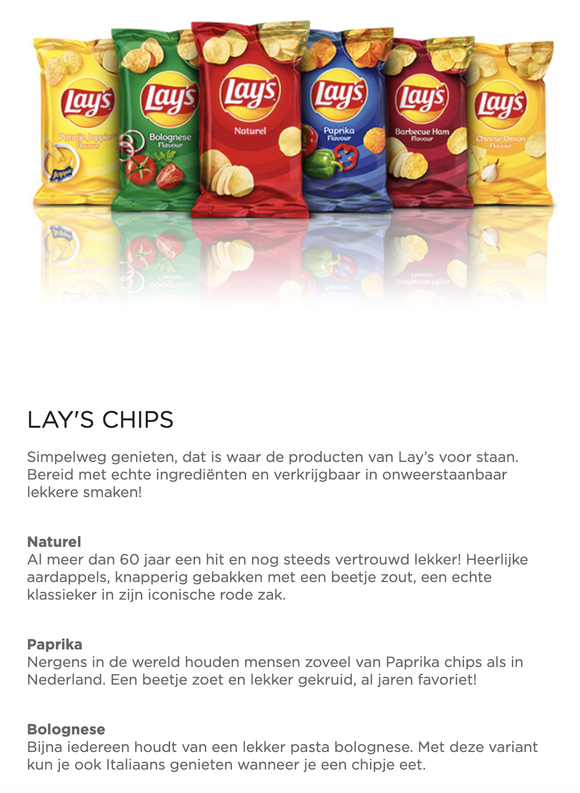

# Procesverslag
**Auteur:** -Danny Frelink-

Markdown cheat cheet: [Hulp bij het schrijven van Markdown](https://github.com/adam-p/markdown-here/wiki/Markdown-Cheatsheet). Nb. de standaardstructuur en de spartaanse opmaak zijn helemaal prima. Het gaat om de inhoud van je procesverslag. Besteedt de tijd voor pracht en praal aan je website.

## Bronnenlijst
1. -bron 1 Lay's website: https://lays.nl/assortiment -
2. -bron 2 Logo verkleinen na scroll: https://stackoverflow.com/questions/15798360/show-div-on-scrolldown-after-800px -
3. -bron 3 img in readme scalen: https://gist.github.com/uupaa/f77d2bcf4dc7a294d109 -
4. -bron4 img in readme naast elkaar: https://stackoverflow.com/questions/24319505/how-can-one-display-images-side-by-side-in-a-github-readme-md/31571776 -

## Eindgesprek (week 7/8)

-dit ging goed & dit was lastig-

**Screenshot(s):**

-screenshot(s) van je eindresultaat-

## Voortgang 3 (week 6)

-same as voortgang 1-

## Voortgang 2 (week 5)

### Stand van zaken

Deze week ben ik bezig geweest met het helemaal afronden van mijn website en dat is gelukt. Ik heb geprobeerd om echt elk detail van de Lay's website na te maken en dat is (vind ik zelf) zeer goed gelukt.

Mocht ik later nog tijd over hebben, ga ik nog kijken of ik extra dingen zoals animaties e.d. kan toevoegen. 

**Screenshot(s):**

    
    

    
    

### Agenda voor meeting

Ikzelf had geen punten om bij de meeting te bespreken, aangezien ik mijn hele website al af heb. Verder wilde mijn groepje meer te weten komen over de Readme en hoe deze weergegeven moest worden.

### Verslag van meeting

De meeting was kort en relaxt en de vragen werden allemaal duidelijk beantwoord. Ik ga na deze meeting nog even mijn readme beter stylen door de images minder groot weer te geven.

## Tussenfase (week 4)

Doordat we veel deadlines hadden van andere vakken, heb ik na het voortgangsgesprek een lange tijd niks gedaan/kunnen doen. Ik liep ook flink vast met hoe ik mijn website nou echt goed responsive ging krijgen. Hiervoor werd het bij de les over Grids al iets duidelijker.

Ik ben aan de gang gegaan met Grid en liep al snel opnieuw vast en moest om hulp gaan vragen. Uiteindelijk heb ik met Nathan een half uur gezeten en kwamen we erachter dat bijna al mijn problemen opgelost zouden worden met Mediaqueries, wat de volgende les zou zijn. Hiervoor had ik dus nog even geduld nodig.

Uiteindelijk ben ik zelf aan de gang gegaan met Mediaqueries en was het minder lastig dan verwacht. De site begint nu al een stuk meer responsive te worden dan het vorige week was.

## Voortgang 1 (week 3)

### Stand van zaken

Ik ben deze week bezig geweest met het compleet afmaken van mijn mobiele versie van de website. Alles is dus nu met flexbox gemaakt en ik heb geprobeerd om meteen ook te kijken naar of het responsive te maken was.

Ik heb nog steeds moeite met het hamburgermenu en besloot daarom om hulp te vragen aan de docenten en studentassistenten. Hierdoor is het ook lastig om de navigatie van mijn namaak website gelijk te krijgen aan die van het origineel.

Nadat ik een tip had gekregen, heb ik mijn hamburger menu gemaakt met behulp van Javascript. Hiervoor heb ik eerst de styling gegeven aan mijn uitgeklapte menu a.d.h.v. een classlist en vervolgens met JS ervoor gezorgd dat deze toe wordt gevoegd als er op het hamburgermenu wordt geklikt.

**Screenshot(s):**

    
    

    
    

### Agenda voor meeting

We besloten om ons te focussen op het hamburgermenu, de styling hiervan en zelf wilde ik nog wat dingen vragen over de transitie hiervan.

### Verslag van meeting

Duidelijk geworden hoe we verder kunnen en genoeg vragen kunnen stellen en uitleg kunnen krijgen.

## Tussenfase (week 2)

Ik ben in deze week begonnen met het maken van het skelet van mijn website. Hiervoor heb ik eerst de hele assortiment pagina nagemaakt, door alle codes in de juiste volgorde onder elkaar te zetten. Vervolgens heb ik de CSS voor de typografie toegevoegd aan mijn website.

Nadat het college van deze week had plaatsgevonden, ben ik meteen mijn detailpagina gaan maken, door hier de code van mijn assortiment pagina toe te voegen en hier een extra section aan toe te voegen. Verder ben ik ook aan de slag gegaan met het positioneren van mijn content, waardoor ik delen van mijn content op bepaalde plekken vast kon zetten.

Al voordat het tweede college van deze week kwam, ben ik aan de gang gegaan met flexbox. Ik ben de navigatie van mijn website naast elkaar gaan zetten en heb ervoor gezorgd dat alle afmetingen klopte. Ik heb nog wel een probleem, aangezien ik een hamburger menu moet gaan gebruiken, maar nog niet weet hoe dit werkt, dus loop ik een beetje vast. Volgens Danny, gaan we hier volgende week mee aan de slag. Ook de onderdelen van de footer ben ik gaan flexboxen en ik begin nu ook met de vormgeving van mijn website zelf.

## Intake (week 1)

**Je startniveau:** -Rood, aangezien ik coderen leuk vind, maar er (buiten de vakken van jaar 1) geen ervaring mee heb. Ik zal dus wel tijd nodig hebben om er weer in te komen.-

**Je focus:** -Responsive, want ik heb hier nog nooit mee gewerkt en wil dit dus leren. Uiteraard wil ik als dit makkelijk lukt, ook kijken naar de extra aandacht voor de surface laag.-

**Je opdracht:** -Ik ga de Lays website namaken, waarbij ik de assortiment pagina en de detailpagina van dit assortiment wil maken (zie beide screenshots). Ik heb deze website gekozen omdat er gebruik wordt gemaakt van een soort schaakbord layout op desktop die op mobile opeens op elkaar aansluit. Ik wil dus leren hoe is dit responsive kan laten worden en ik denk dat dit een mooie uitdaging is. Link naar website is: https://lays.nl/assortiment -

**Screenshot(s):**

    
    

**Breakdown-schets(en):**

    
    

